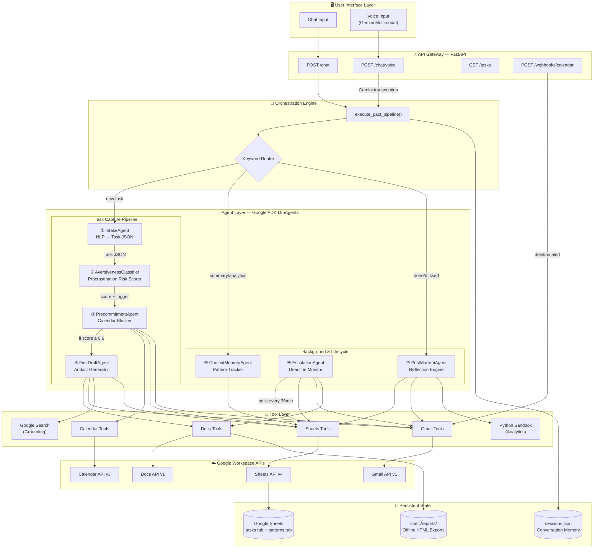
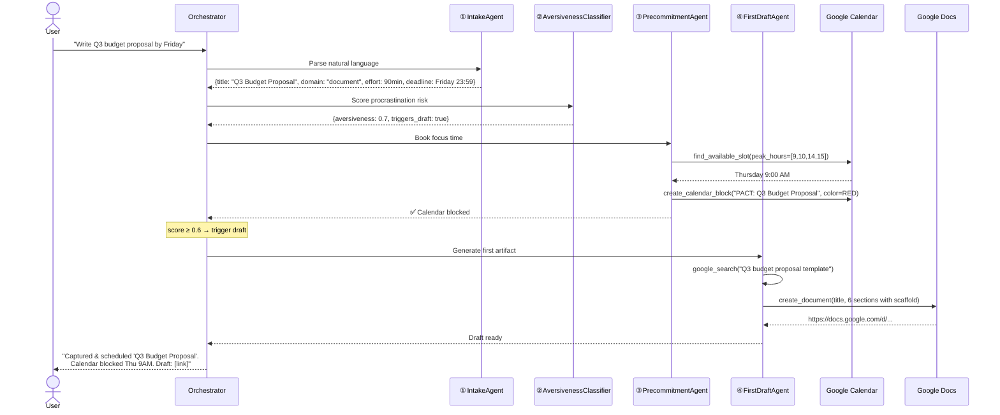
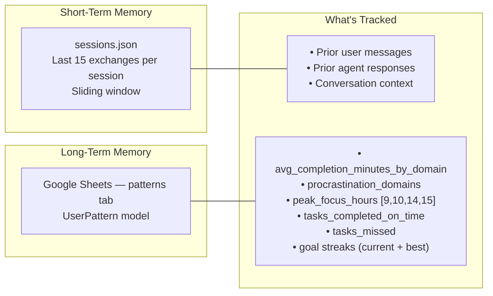
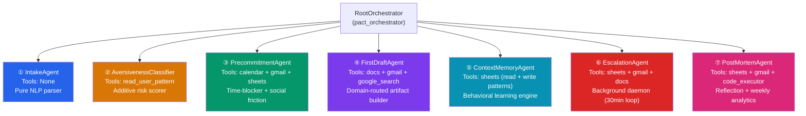
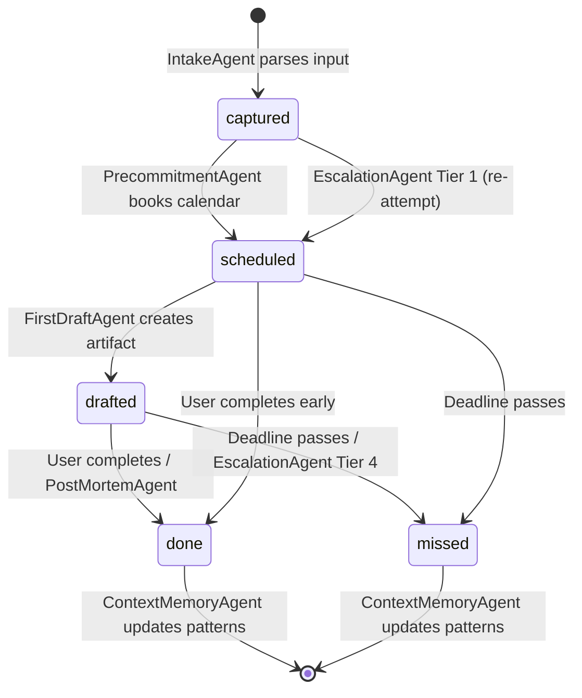
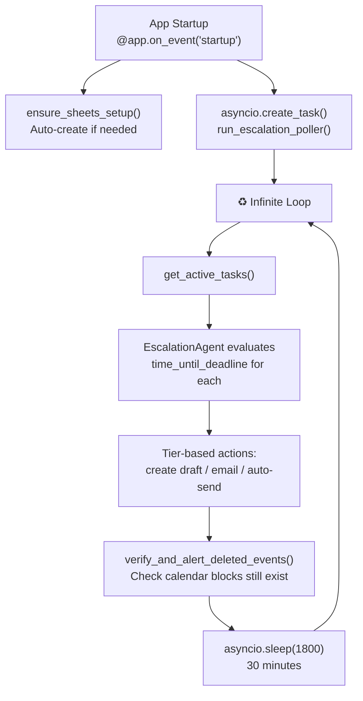

# PACT — Architecture & System Design

> **Proactive Autonomous Commitment Tracker** — A multi-agent productivity system that doesn't just remind you about tasks, it *does the first step for you*.

---

## System Architecture



---

## How It Works — The Core Flow

When a user says *"Write a Q3 budget proposal by Friday"*, here's what happens in ~10 seconds:



The user typed **one sentence**. The system produced a **calendar block**, a **Google Doc with 6 sections**, and if the task was high-risk, notified their **accountability partner**. All autonomous.

---

## Key Design Decisions

### 1. How We Solve Memory

PACT has **two memory systems** working at different timescales:



**Short-term memory** (`sessions.json`):
- Stores the last **15 conversation exchanges** per session ID
- Loaded at the start of every pipeline run and prepended to agent prompts as `"Prior Conversation History:"`
- Enables multi-turn context: *"schedule that for tomorrow instead"* works because the agent sees what "that" refers to
- Sliding window prevents unbounded growth

**Long-term memory** (`UserPattern` in Google Sheets):
- Survives across sessions, permanently stored in Sheets
- **Self-updating**: After every task lifecycle (done/missed), the `ContextMemoryAgent` recomputes:
  - Which domains the user procrastinates on (last 3 tasks with aversiveness > 0.65)
  - What hours they actually complete work (clustered from completion timestamps)
  - Average time per domain
  - Goal/habit streak tracking
- This data **feeds back into future scoring**: the AversivenessClassifier reads the pattern to check if a new task's domain is in the user's `procrastination_domains` (+0.4 to score)

**Why Google Sheets?** It's a persistent, user-visible, zero-infrastructure database. The user can literally open their Sheets and see their own data. No database to manage, no migrations, and it works on Google Cloud with zero setup.

---

### 2. How We Solve Procrastination — The Aversiveness Scoring System

This is the psychological core of PACT. We don't just remind users — we **predict** which tasks they'll avoid and **intervene preemptively**.

```
Aversiveness Score = 0.0
  + 0.4  if domain ∈ user's procrastination history
  + 0.3  if no concrete first step in description
  + 0.2  if domain is "document" or "research"
  + 0.2  if deadline is > 72 hours away (distant = avoidable)
  - 0.2  if external recipient/hard deadline (social pressure helps)
────────
  Cap at 1.0

Score ≥ 0.6 → Trigger automatic first draft
Score ≥ 0.7 → Also trigger social accountability (email partner)
```

**Why this works**: Behavioral psychology research shows procrastination is triggered by:
- **High activation energy** (no clear first step) → We generate the first draft
- **Temporal distance** (deadline feels far) → We escalate earlier for high-risk tasks
- **Domain avoidance patterns** (past behavior predicts future) → We learn from history
- **Lack of social accountability** → We notify a partner if you delete your calendar block

---

### 3. How We Solve Escalation — Dynamic Temporal Discounting

The EscalationAgent runs as a **background async loop** (every 30 minutes) and applies pressure that **increases as deadlines approach**:

```
                    Standard Tasks              High-Risk Tasks (score ≥ 0.6)
                    ──────────────              ─────────────────────────────
  ≥ 24h / ≥ 36h    Tier 1: Create draft         Same, but triggered EARLIER
  6-24h / 12-36h   Tier 2: Email "here's your   Same, but triggered EARLIER
                           draft, reply YES"
  1-6h / 3-12h     Tier 3: Urgent reminder       Same, but triggered EARLIER
  < 1h / < 3h      Tier 4: AUTO-SEND or alert    Same, but triggered EARLIER
```

**The key insight**: High-aversiveness tasks get **shifted thresholds**. A task scored 0.8 starts getting Tier 1 treatment at **36 hours** out instead of 24 — because we know from behavioral science that procrastination windows open earlier for dreaded tasks.

**Calendar deletion accountability**: If a user deletes a PACT calendar block without completing the task:
1. Webhook fires → `POST /webhooks/calendar`
2. System checks if task is still active
3. If `aversiveness_score ≥ 0.7`: emails accountability partner with `[HIGH RISK]` tag
4. Resets task status to `"captured"` so the cycle restarts

This creates **social friction** — the cost of avoiding work is being "caught."

---

### 4. How We Solve Task Decomposition — Cognitive Load Reduction

Large tasks trigger avoidance. PACT automatically breaks them down:

```
User: "Write a research paper on renewable energy trends"

IntakeAgent detects: domain = "research", effort > 60 min
                     → AUTO-DECONSTRUCT into micro-tasks

Output:
├── [PACT Part 1] "Search Google for 3 key renewable energy reports" (15 min)
├── [PACT Part 2] "Open Google Doc and outline 5 section headers" (15 min)
├── [PACT Part 3] "Write introduction paragraph with key statistics" (20 min)
└── [PACT Part 4] "Draft findings section from research notes" (25 min)

Each micro-task gets:
  → Its own aversiveness score
  → Its own calendar block
  → Its own draft artifact (if triggered)
```

**Trigger conditions**: `effort > 60 minutes` OR `domain ∈ {document, research}`

Each micro-task represents the **smallest physical action** — not "write the paper" but "open Google Doc and type 5 headers." This is based on the "2-minute rule" principle: if the first step takes under 2 minutes, you're far more likely to start.

---

### 5. How We Solve Artifact Generation — Domain-Routed First Drafts

The FirstDraftAgent doesn't just remind you — it **does the first step**:

| Domain | What PACT Creates | How |
|---|---|---|
| `email` | Full Gmail draft with subject + body | Google Search for recipient context → `create_draft` |
| `document` | Google Doc with intro + 4-6 H2 sections | Google Search for topic research → `create_document` |
| `research` | Research findings doc with sources | 4-5 Google Search queries → synthesize → `create_document` |
| `booking` | Top 3 options with booking links | Google Search providers → `write_local_report` |
| `payment` | Direct payment portal link | Google Search portal → `write_local_report` |
| `form` | Direct form/prefill link | Google Search form → `write_local_report` |
| `other` | Step-by-step checklist | Generate actionable steps → `write_local_report` |

Every artifact is **grounded in real-time data** via `google_search`. The agent doesn't hallucinate booking links — it searches for them.

---

### 6. How We Solve Auth — OAuth 2.0 Web Server Flow

PACT needs 4 Google API scopes across 4 services. We handle this with a **single OAuth consent**:

```
Scopes: calendar, gmail.modify, documents, spreadsheets
            ↓
    Single consent screen → Single token.json
            ↓
    Factory pattern: get_calendar_service(), get_gmail_service(), etc.
            ↓
    Token auto-refresh on expiry
    Fallback: env vars (GOOGLE_REFRESH_TOKEN) for headless deploy
```

**Two auth modes**:
1. **Web flow**: User clicks "Connect Google" → consent → callback → token saved
2. **Headless deploy**: Pre-provisioned `GOOGLE_REFRESH_TOKEN` in env vars (for Google Cloud)

---

## Agent Wiring — The 7-Agent System



All 7 agents are `google-adk` `LlmAgent` instances running on `gemini-3.5-flash`. The orchestrator doesn't use ADK's automatic routing — it uses **deterministic keyword matching** to select the right pipeline path, then chains agents **sequentially** with JSON data passing between them.

---

## Data Models

### Task Lifecycle



### Task Schema (14 fields)

```python
class Task(BaseModel):
    id: str                         # UUID4
    raw_input: str                  # Original user text
    title: str                      # Parsed title
    deadline: datetime              # Absolute ISO 8601
    domain: Literal["email", "document", "research",
                    "booking", "payment", "form", "other"]
    effort_estimate_minutes: int    # AI-estimated
    aversiveness_score: float       # 0.0–1.0
    status: Literal["captured", "scheduled", "drafted", "done", "missed"]
    calendar_event_id: str?         # Google Calendar event
    draft_url: str?                 # Doc URL or Gmail draft ID
    goal_id: str?                   # Linked goal
    escalation_tier: str?           # tier1/tier2/tier3/tier4
    created_at: datetime
    updated_at: datetime
```

### UserPattern Schema (learning profile)

```python
class UserPattern(BaseModel):
    user_id: str
    avg_completion_minutes_by_domain: Dict[str, float]  # {"email": 25, "research": 120}
    procrastination_domains: List[str]                   # ["document", "research"]
    peak_focus_hours: List[int]                          # [9, 10, 14, 15]
    tasks_completed_on_time: int
    tasks_missed: int
    goals: List[Goal]                                    # Streak tracking
```

---

## State Architecture — Google Sheets as Database

```
┌─────────────────────────────────────────────────┐
│  Google Sheets Document                          │
│                                                  │
│  Tab: "tasks" (14 columns)                       │
│  ┌──────┬────────┬────────┬────────┬─────┬─────┐│
│  │  id  │ title  │deadline│ domain │score│status││
│  ├──────┼────────┼────────┼────────┼─────┼─────┤│
│  │ abc  │ Q3 Bud │ Jul 4  │  doc   │ 0.7 │draft││
│  │ def  │ Email  │ Jul 2  │ email  │ 0.3 │ schd││
│  └──────┴────────┴────────┴────────┴─────┴─────┘│
│                                                  │
│  Tab: "patterns" (7 columns)                     │
│  ┌─────────┬──────────┬────────────┬────────────┐│
│  │ user_id │ avg_comp │ procrast   │ peak_hours ││
│  ├─────────┼──────────┼────────────┼────────────┤│
│  │ default │ {JSON}   │ ["doc"]    │ [9,10,14]  ││
│  └─────────┴──────────┴────────────┴────────────┘│
│                                                  │
│  Auto-provisioned if SHEETS_ID is empty          │
│  Shared publicly (anyone/writer)                 │
└─────────────────────────────────────────────────┘
```

**Why Sheets instead of a real database?**
- Zero infrastructure — no database server, no migrations
- User-visible — they can open the sheet and see their own data
- Works with Google OAuth already in our scope
- Auto-provisionable from code
- Survives redeployments without data loss

---

## Background Processing



The escalation poller is the only background process. It's a single `asyncio` task launched at startup — no Celery, no Redis, no message queue. Simple and effective.

---

## Tech Stack Summary

| What | Why We Chose It |
|---|---|
| **Google ADK** (`LlmAgent`) | Native agent framework — FunctionTool binding, InMemoryRunner, output_key |
| **Gemini 3.5 Flash** | Fast, supports tool calling, multimodal (voice), code execution |
| **FastAPI** | Async-native, auto-docs, lightweight, easy to deploy |
| **Google Sheets** | Zero-ops database, user-visible, auto-provisionable |
| **Google Calendar** | Time-blocking = behavioral precommitment device |
| **Gmail API** | Draft creation, escalation emails, accountability alerts |
| **Google Docs** | Real artifact generation (not fake placeholders) |
| **Google Search** (ADK built-in) | Grounded outputs — real data, not hallucinated |
| **BuiltInCodeExecutor** | Python sandbox for PostMortem analytics (safe execution) |
| **Pydantic** | Type-safe data models with serialization to/from Sheets rows |

---

## Error Handling & Resilience

| Failure | What Happens |
|---|---|
| Gemini rate limit (429/503) | 3× retry with exponential backoff (2s → 4s → 8s) |
| Sheets API unavailable | Returns default UserPattern, empty task lists — system still works |
| Calendar API error | Falls back to suggesting next peak hour |
| IntakeAgent can't parse | Returns user-friendly: "I couldn't structure that task" |
| Voice transcription fails | Returns "I couldn't hear any task details" |
| OAuth not configured | RuntimeError with setup instructions |
| Calendar block deleted | Webhook detects, alerts accountability partner, resets task |

---

## Deployment

```bash
# Procfile (Google Cloud / Heroku)
web: python3 -m uvicorn pact.app.agent:app --host 0.0.0.0 --port $PORT
```

**Required env vars**: `GEMINI_API_KEY`, `GOOGLE_CLIENT_ID`, `GOOGLE_CLIENT_SECRET`
**Optional**: `SHEETS_ID` (auto-created), `ACCOUNTABILITY_EMAIL`, `AUTO_SEND_ENABLED`
