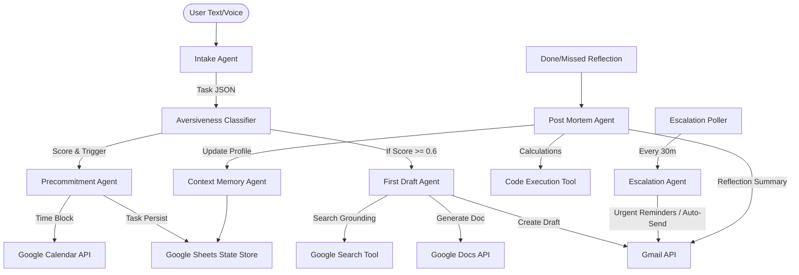

# PACT — Architecture Design Specification

## Overview

PACT is a multi-agent system built on the Google Agent Development Kit (ADK) that mitigates user procrastination by proactively transitioning captured tasks into initial concrete drafts.

## System Stack

- **Agentic Orchestrator**: `google-adk` LlmAgent.
- **Model Family**: `gemini-3.5-flash` for multi-step tools; `gemini-3.1-flash-live-preview` for voice.
- **State Store**: Google Sheets API.
- **Reminders / Time Blocks**: Google Calendar API & Gmail API.
- **Output Artifacts**: Google Docs API & Gmail API.

---

## Agents & Sub-agents

1. **RootOrchestrator**: Directs capture flow, queries summary stats, or handles reflections.
2. **IntakeAgent**: Parses raw inputs into Task objects using absolute deadlines.
3. **AversivenessClassifier**: Evaluates task risk and flags for immediate draft triggers.
4. **PrecommitmentAgent**: Blocks slots during peak hours.
5. **FirstDraftAgent**: Builds draft documents with grounded references.
6. **ContextMemoryAgent**: Tracks user metrics, goal streaks, and schedules.
7. **EscalationAgent**: Background polling and auto-delivery alerts.
8. **PostMortemAgent**: Performs lifecycle cleanup and runs Python sandbox data aggregates.
